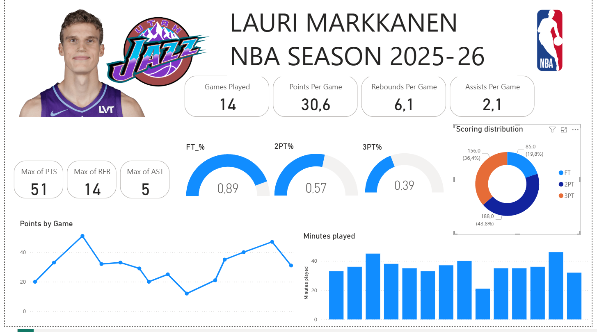
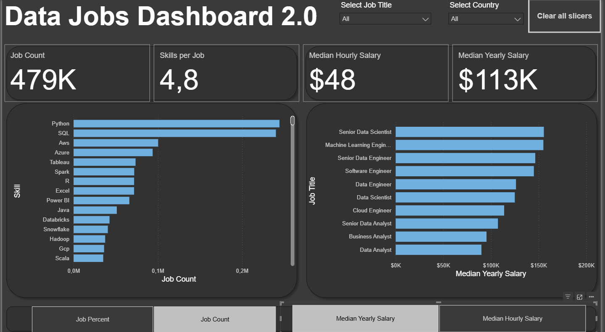

# Dashboards with Power Bi

## Introduction

The purpose of this of this portfolio is to showcase some of the dashboards
I have created and to demonstrate my skills using Power BI.

Links to Power BI Service:

[Lauri Markkanen](https://app.powerbi.com/groups/me/reports/e080e58a-a31e-4be9-a8e4-84552a68d0d1/08e722170e3d031f2142?experience=power-bi)

[(Data Jobs 2.0](https://app.powerbi.com/groups/me/reports/171fa211-44ba-40c5-afdb-35a92666b505/689d2d593ce35984360b?experience=power-bi)

[Data Jobs Dashboard](https://app.powerbi.com/groups/me/reports/411ac543-7497-482a-8f65-7c65791371c0/31435a5aff9fcb6ff281?experience=power-bi)

[World Population](https://app.powerbi.com/groups/me/reports/d4c357a5-5ae2-4c76-af0e-993287105eba/52331e3d71b692737006?experience=power-bi)

